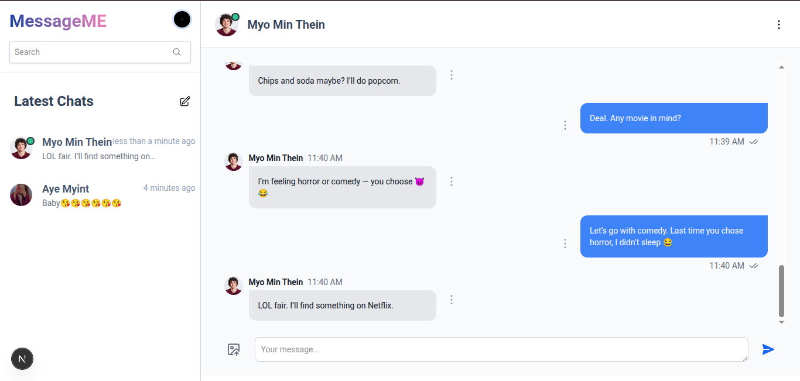

# 💬 MyChatApp

A real-time chat application built with **Django** (backend) and **Next.js** (frontend). Features include one-to-one messaging, Google OAuth login, WebSocket-based real-time messaging, typing indicators, and more.

---

## 🛠 Development Setup

### ⚙️ Backend Setup

#### 1. Navigate to the backend folder

```bash
cd backend
```

#### 2. Create `.env` file

Make a `.env` file in the root of the backend folder. Use the structure from the provided `env.example` as a reference.

#### 3. start Docker

```bash
docker compose up --build
```

---

### 🌐 Frontend Setup

#### 1. Create a `.env` file

In the frontend project root, create a `.env` file with the following contents:

```env
NEXT_PUBLIC_BACKEND_URL_API=http://localhost:8000
NEXT_PUBLIC_BACKEND_HOST_NAME=localhost:8000
NEXT_PUBLIC_GOOGLE_OAUTH_CLIENT_ID=your_google_oauth_client_id
```

#### 2. Start the development server

```bash
npm run dev
# or
yarn dev
# or
pnpm dev
# or
bun dev
```

---

## ✅ Features

- 🔐 Google OAuth 2.0 authentication
- 💬 Real-time messaging with WebSocket (Django Channels)
- ⌨️ Typing indicators
- 🔔 Instant toast notifications for new messages
- 🧵 Support for message replies
- 📬 Online/offline presence detection
- 🧑‍🤝‍🧑 One-on-one conversation support
- 🐳 Docker support for backend services

---

## 🧪 Tech Stack

| Layer    | Technology                     |
| -------- | ------------------------------ |
| Frontend | Next.js, Tailwind CSS, Zustand |
| Backend  | Django, Django Channels        |
| Realtime | Redis, WebSocket               |
| Auth     | Google OAuth (via allauth)     |
| Database | PostgreSQL                     |
| DevOps   | Docker                         |

---

## 📂 Project Structure

```
mychatapp/
├── backend/
    └── .env
│   ├── chat_backend/
├── ├── docker-compose.yml
│   └── venv/
├── frontend/
│   └── .env
└── README.md
```

---

## 🚀 How It Works

- On login, users authenticate via Google OAuth.
- Conversations and messages are synced in real-time via WebSockets.
- When a user types, typing status is shown live to the other user.
- Notifications pop up when a new message arrives in other conversations.

---

## 🧾 License

This project is open source and available for personal and educational use.

---

## 📸 Demo Screenshots (Optional)



---

## 🙌 Contributions

Pull requests and feedback are welcome!
